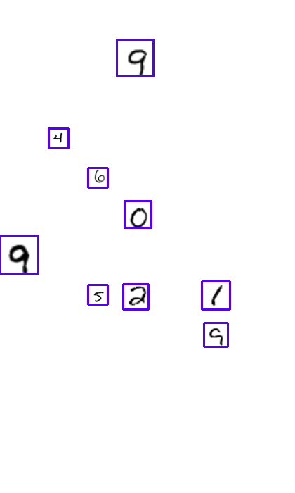
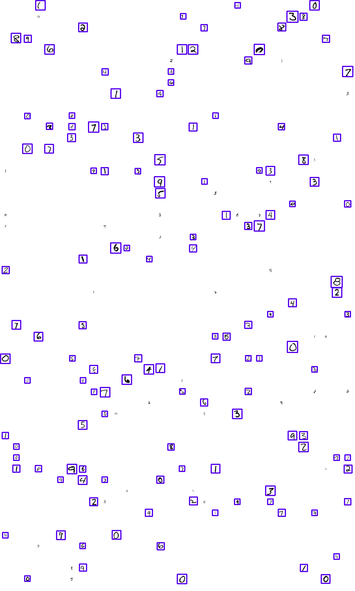
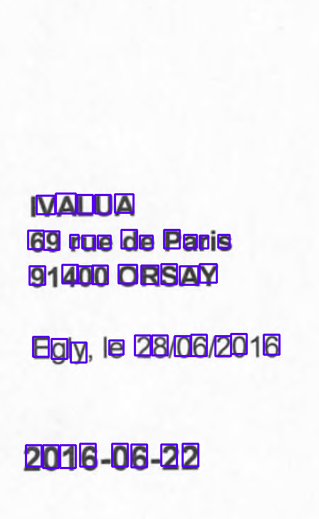
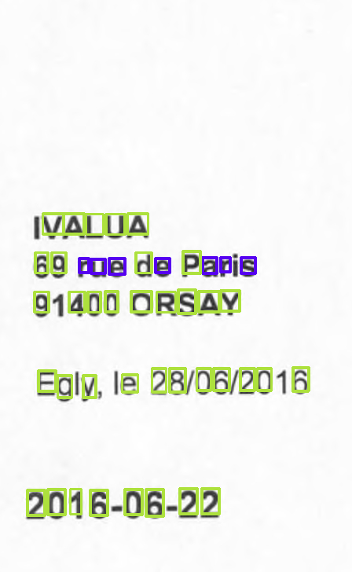
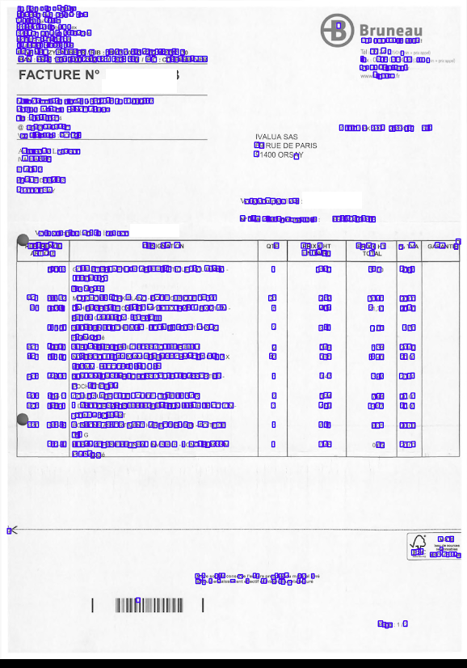

# Pretrained document features for document OCR, classification and segmentation

The objective of this repository is to develop pretrained features for document images to be used in document classification, segmentation, OCR and analysis. The pretrained features are being trained upon OCR results from a OCR technology, such as Tesseract.

    


[PDF paper](images/Object_detection_deep_learning_networks_for_Optical_Character_Recognition.pdf)


## Features

- **Python 2 and Python 3 support**

- **Tensorflow and CNTK support**

To run the training with CNTK, activate the Python environment `source activate keras-tf-py27` and set backend value to `tensorflow` in `~/.keras/keras.json`.

To run the training with CNTK, activate the Python environment `source activate cntk-py27` and set backend value to `cntk` in `~/.keras/keras.json`.

- **Multi-GPUs support**

To enable parallel computing with multi-gpus:
```
python train.py -p
```

For CNTK, start parallel workers to use all GPUs:
```
mpiexec --npernode 4 python train.py -p
```

- **TensorBoard visualization** Train and validation loss, objectness accuracy per layer scale, class accuracy per layer scale, regression accuracy, object mAP score, target mAP score, original image, objectness map, multi layer detections, detections after non-max-suppression, target and groundtruth.


## Install requirements

- Ubuntu 17.4

- GPU support: [NVIDIA driver](http://www.nvidia.fr/download/driverResults.aspx/131287/fr), [Cuda 9.0](https://developer.nvidia.com/cuda-90-download-archive) and [Cudnn 7.0.4](https://developer.nvidia.com/rdp/form/cudnn-download-survey) (requirement by CNTK)

- [CNTK install with MKL/OpenMPI/Protobuf/Zlib/LibZip/Boost/Swig/Anaconda3/Python support](https://docs.microsoft.com/en-us/cognitive-toolkit/Setup-CNTK-on-Linux)

Create cntk-py35 and cntk-py27 Conda environments following their specs.

Build: `../../configure  --with-swig=/usr/local/swig-3.0.10 --with-py35-path=$HOME/anaconda3/envs/cntk-py35 --with-py27-path=$HOME/anaconda3/envs/cntk-py27`

Update their environments to add Keras and other libraries for the current code :
```
conda env update --file cntk-py27.yml
conda env update --file cntk-py35.yml
```

- Tensorflow and Python 2.7
```
conda env update --file keras-tf-py27.yml
```

- Tensorflow and Python 3.5
```
conda env update --file keras-tf-py35.yml
```

- HDF5 to save weights with Keras

```
sudo apt-get install libhdf5-dev
```


## Run

Activate one of the Conda environments:
```
source activate cntk-py27
source activate cntk-py35
source activate keras-tf-py27
source activate keras-tf-py35
```

For help on available options:

```
python train.py -h
python3 train.py -h

Using TensorFlow backend/
Using CNTK backend
Selected GPU[3] GeForce GTX 1080 Ti as the process wide default device.
usage: train.py [-h] [-b BATCH_SIZE] [-p] [-e EPOCHS] [-l LOGS] [-m MODEL]
                [-lr LEARNING_RATE] [-s STRIDE_SCALE] [-d DATASET] [-w WHITE]
                [-n] [--pos_weight POS_WEIGHT] [--iou IOU]
                [--nms_iou NMS_IOU] [-i INPUT_DIM] [-r RESIZE] [--no-save]
                [--resume RESUME_MODEL]

optional arguments:
  -h, --help            show this help message and exit
  -b BATCH_SIZE, --batch_size BATCH_SIZE
                        # of images per batch
  -p, --parallel        Enable multi GPUs
  -e EPOCHS, --epochs EPOCHS
                        # of training epochs
  -l LOGS, --logs LOGS  log directory
  -m MODEL, --model MODEL
                        model
  -lr LEARNING_RATE, --learning_rate LEARNING_RATE
                        learning rate
  -s STRIDE_SCALE, --stride_scale STRIDE_SCALE
                        Stride scale. If zero, default stride scale.
  -d DATASET, --dataset DATASET
                        dataset
  -w WHITE, --white WHITE
                        white probability for MNIST dataset
  -n, --noise           noise for MNIST dataset
  --pos_weight POS_WEIGHT
                        weight for positive objects
  --iou IOU             iou treshold to consider a position to be positive. If
                        -1, positive only if object included in the layer
                        field
  --bb_positive BB_POSITIVE
                        Possible values: iou-treshold, in-anchor, best-anchor
  --nms_iou NMS_IOU     iou treshold for non max suppression
  -i INPUT_DIM, --input_dim INPUT_DIM
                        network input dim
  -r RESIZE, --resize RESIZE
                        resize input images
  --no-save             save model and data to files
  --resume RESUME_MODEL
  --n_cpu N_CPU         number of CPU threads to use during data generation
```

## OCR Training

### Toy dataset with MNIST "ocr_mnist"


Train image recognition of digits on a white background (inverted MNIST images):

| Command | Obj acc | Class acc | Reg acc | Obj mAP |
| --- | --- | --- | --- | --- |
| `python train.py` | 100 | 99.2827 | 1.60e-10 | 99.93 |
| With noise `python train.py -n` | 99.62 | 98.92 | 4.65e-6 | 98.41 |


With stride 12 instead of default 28:

| Command | Obj acc | Class acc | Reg acc | Obj mAP | Target mAP |
| --- | --- | --- | --- | --- | --- |
| `python train.py -s 6 --iou .15` | 96.37 | 36.25 | 0.010 | **99.97** | 100 |
| `python train.py -s 6 --iou .2` | 98.42 | 28.56 | 0.012 | 99.75 | 100 |
| `python train.py -s 6 --iou .25` | 97.05 | 36.42 | 0.015 | 99.52 | 100 |
| `python train.py -s 6 --iou .3` | 98.35 | 92.78 | 0.0013 | 99.88 | 100 |
| `python train.py -s 6 --iou .35` | 98.99| 83.72| 0.0069 | 99.22 | 100 |
| `python train.py -s 6 --iou .4` | 98.70 | 94.96| 0.0066 | 98.37 | 100 |
| `python train.py -s 6 --iou .5` | 96.71 | 95.46 | 0.0062| 91.09 | 95.71 |
| `python train.py -s 6 --iou .6` | 99.92| 98.23| 4.8e-05 | 51.80 | 54.32 |
| `python train.py -s 6 --iou .8` | 99.90 | **97.90** | 7.67e-05 | 8.5 | 10.63 |
| `python train.py -s 6 --iou .95` | **99.94** | 97.27 | 3.7-07 | 10.80 | 12.21 |
| `python train.py -s 6 --iou .99` | 99.91 | 97.66 | 7.06e-07 | 9.3 | 11.71 |


With stride 4:

| Command | Obj acc | Class acc | Reg acc | Obj mAP | Target mAP |
| --- | --- | --- | --- | --- | --- |
| `python train.py -s 2 --iou .2` | 98.51 | 72.71 | 0.034 | 99.99 | 100 |
| `python train.py -s 2 --iou .25` | 98.63 | 78.53 | 0.018 | **100** | 100 |
| `python train.py -s 2 --iou .3` | 97.88 | 94.54 | 0.0098 | 99.89 | 100 |
| `python train.py -s 2 --iou .4` | 96.85 | 97.41 | 0.0098 | 99.93 | 100 |
| `python train.py -s 2 --iou .5` | 94.14 | 98.81 | 0.0099 | 99.61 | 100 |
| `python train.py -s 2 --iou .6` | 99.80 | 98.57 | 0.00031 | 99.93 | 100 |
| `python train.py -s 2 --iou .7` | 99.64 | 98.21 | 0.0016 | 99.77 | 100 |
| `python train.py -s 2 --iou .8` | 100 | 98.19 | 1.7e-8 | 82.24 | 100 |
| `python train.py -s 2 --iou .8 -e 30` | 99.98 | 99.35 | 1.73e-9 | 91.05 | 100 |


Train on scale ranges [14-28]:

| Command | Obj acc | Class acc | Reg acc | Obj mAP | Target mAP |
| --- | --- | --- | --- | --- | --- |
| `python train.py -r 14-28 -s 6 --iou .25 -e 30` | 99.10 | 89.37 | 0.0017 | 99.58 | 100 |


With bigger net:

| Command | Obj acc | Class acc | Reg acc | Obj mAP | Target mAP |
| --- | --- | --- | --- | --- | --- |
| `python train.py -m CNN_C64_C128_M2_C256_D -s 6 --iou .5` | 99.59 | 98.02 | 0.00078  | 92.32 | 94.89 |
| `python train.py -m CNN_C64_C128_M2_C256_D -s 6 --iou .4` | 99.17 | 97.23 | 0.0047 | 99.79 | 100 |
| `python train.py -m CNN_C64_C128_M2_C256_D -s 6 --iou .3` | 99.74 | 96.84 | 0.00043 | **100** | 100 |
| `python train.py -m CNN_C64_C128_M2_C256_D -s 6 --iou .2` | 97.57 | 91.14 | 0.0016 | 99.98 | 100 |
| `python train.py -m CNN_C64_C128_M2_C256_D -s 6 --iou .15` | 98.02 | 83.85 | 0.0083 | 99.95 | 100 |
| `python train.py -m CNN_C64_C128_M2_C256_D -s 2 --iou .5` | 99.80 | 98.87 | 0.00053 | **100** | 100 |
| `python train.py -m CNN_C64_C128_M2_C256_D -s 2 --iou .25` | 99.48 |95.78 | 0.00054 | 100 | 100 |
| `python train.py -r 14-28 -m CNN_C64_C128_M2_C256_D -s 6 --iou .25 -e 30` | 96.58 | 91.42 | 0.0045 | 99.85 | 100 |


Train on scale 56x56:

| Command | Obj acc | Class acc | Reg acc | Obj mAP | Target mAP |
| --- | --- | --- | --- | --- | --- |
| `python train.py -r 56 -m CNN_C32_C64_M2_C64_C64_M2_C128_D` | 99.98 | 99.22 | 7.4e-09 | 99.97 | 100 |
| `python train.py -r 56 -m CNN_C32_C64_M2_C64_C64_M2_C128_D -s 6 --iou .2` | 98.86 | 78.63 | 0.011 | 99.89 | 100 |
| `python train.py -r 56 -m CNN_C32_C64_M2_C64_C64_M2_C128_D -s 6 --iou .3` | 99.36 | 94.60 | 0.0036 | 99.97 | 100 |
| `python train.py -r 56 -m CNN_C32_C64_M2_C64_C64_M2_C128_D -s 6 --iou .4` | 99.23 | 91.11 | 0.048 | **100** | 100 |


Train for two stage networks (scales 28 and 56):

| Command | Obj acc | Class acc | Reg acc | Obj mAP | Target mAP |
| --- | --- | --- | --- | --- | --- |
| `python train.py -r 28,56 -m CNN_C32_C64_M2_C64_C64_M2_C128_D_2` | 99.99/1.0 | 98.62/96.69 | 1.06e-08/4.18e-05 | 99.97 | 100 |
| `python train.py -r 28,56 -m CNN_C32_C64_M2_C64_C64_M2_C128_D_2 -s 6 -e 50` | 99.51/97.76 | 89.83/95.22 | 0.0048/0.016 | 99.44 | 100 |
| `python train.py -r 28,56 -m CNN_C32_C64_M2_C64_C64_M2_C128_D_2 -s 4 -e 30` | 99.39/97.46 | 85.21/92.19 | 0.0054/0.022 | 99.64 | 100 |


Train on scale ranges [28-56], two stages [14-28,28-56] and [14, 56]:

| Command | Obj acc | Class acc | Reg acc | Obj mAP | Target mAP |
| --- | --- | --- | --- | --- | --- |
| `python train.py -r 28-56 -m CNN_C32_C64_M2_C64_C64_M2_C128_D -s 6 --iou .25 -e 30` | 98.99 | 93.92 | 0.0018 | 99.89 | 100 |
| `python train.py -r 14-28,28-56 -m CNN_C32_C64_M2_C64_C64_M2_C128_D_2 -s 6 --iou .25 -e 30` | 98.92/98.04 | 64.06/91.08 | 0.0037/0.0056 | 98.82 | 99.90 |
| `python train.py -r 14-28,28-56 -m CNN_C32_C64_M2_C64_C64_M2_C128_D_2 -s 6 --iou .2 -e 30` | 98.57/97.73 | 58.30/79.84 | 0.0058/0.0036 | 98.31 | 99.90 |
| `python train.py -r 14-28,28-56 -m CNN_C64_C128_M2_C128_C128_M2_C256_D_2 -s 6 --iou .25 -e 30` | 99.10 / 98.16 | 93.64 / 95.28 | 0.0016 / 0.0014 | 98.42 | 99.93 |
| `python train.py -r 14-28,28-56 -m CNN_C64_C128_M2_C128_C128_M2_C256_D_2 -s 6 --iou .25 -e 50` | 99.26 / 98.78 | 93.91 / 94.02 | 0.0010 / 0.0014 | 98.81 | 99.93 |
| `python train.py -r 14-28,28-56 -m CNN_C64_C128_M2_C128_C128_M2_C256_D_2 -s 6 --iou .2 -e 50` | 99.05/98.05 | 89.88/91.97 | 0.0021/0.0022 | 99.11 | 99.97 |
| `python train.py -r 14-56 -m CNN_C32_C64_M2_C64_C64_M2_C128_D -s 6 --iou .02 -e 30` | 97.58 | 30.17  | 0.10 | 75.07 | 100 |
| `python train.py -r 14-56 -m CNN_C32_C64_M2_C64_C64_M2_C128_D -s 6 --iou .05 -e 30` | 97.92 | 53.20 | 0.027 | 75.49 | 100 |
| `python train.py -r 14-56 -m CNN_C32_C64_M2_C64_C64_M2_C128_D -s 6 --iou .1 -e 30` | 97.82 | 58.44 | 0.0057 | 87.45 | 92.67 |
| `python train.py -r 14-56 -m CNN_C32_C64_M2_C64_C64_M2_C128_D -s 6 --iou .2 -e 30` | 98.82 | 79.23 | 0.0010 | 72.36 | 75.78 |


Train on lower resolution (digit resize parameter):

| Command | Obj acc | Class acc | Reg acc | Obj mAP | Target mAP |
| --- | --- | --- | --- | --- | --- |
| `python train.py -e 30 -r 14 -m CNN_C32_C64_C128_D`  | 100  | 99.04 | 2.2-12 | 99.91 | 100 |
| `python train.py -e 30 -r 14 -m CNN_C32_C64_C128_D -s 4`  | 97.12  | 94.50 | 0.012 | 99.91 | 100 |
| `python train.py -e 30 -r 14 -m CNN_C32_C64_C128_C`  | 100  | 98.75 | 1.9-05 | 97.02 | 100 |
| `python train.py -e 30 -r 14 -m CNN_C32_C64_C128_C -s 4`  | 98.00 | 91.69 | 0.023 | 93.87 | 100 |
| `python train.py -e 30 -r 7-14 --iou .2 -m CNN_C32_C64_C128_D`  | 99.99  | 96.78 | 8.4e-5 | 99.85 | 100 |
| `python train.py -e 30 -r 7-14 --iou .2 -m CNN_C32_C64_C128_D -s 4`  | 98.58  | 73.07 | 0.0087 | 98.61 | 100 |
| `python train.py -e 30 -r 7-14 --iou .25 -m CNN_C32_C64_C128_D -s 4` | 99.07 | 75.34 | 0.012 | 98.98 | 100 |
| `python train.py -e 30 -r 7-14 --iou .2 -m CNN_C32_C64_C128_C`  | 99.31  | 93.61 | 0.0035 | 92.52 | 100 |
| `python train.py -e 30 -r 7-14 --iou .2 -m CNN_C32_C64_C128_C -s 4`  | 97.22 | 24.87 | 0.0060 | 97.68 | 100 |
| `python train.py -e 30 -r 7-14 --iou .2 -m CNN_C32_C64_C128_C2 -s 4`  | 98.49 | 47.93 | 0.0088 | 98.91 | 100 |
| `python train.py -e 30 -r 7-28 -s 6 -m CNN_C32_C64_C64_Cd64_C128_D --iou .02` | 96.51 | 24.42 | 0.12 | 64.43 | 66.47 |
| ` python train.py -e 30 -r 7-28 -s 4 -m CNN_C32_C64_C64_Cd64_C128_D --iou .2` | 99.12 | 91.01 | 0.0040 | 84.87 | 77.18 |
| `python train.py -e 30 -r 7-28 -s 4 -m CNN_C32_C64_C64_Cd64_C128_D --iou .15` | 98.40 | 77.86 | 0.029 | 88.68 | 85.71 |
| `python train.py -e 30 -r 7-28 -s 4 -m CNN_C32_C64_C64_Cd64_C128_D --iou .1` | 98.20 | 56.96 | 0.086 | 87.51 | 95.34 |
| `python train.py -e 30 -r 7-28 -s 4 -m CNN_C32_C64_C64_Cd64_C128_D --iou .05` | 97.23 | 35.42 | 0.040 | 72.76 | 67.13 |
| `python train.py -e 30 -r 7-28 -s 4 -m CNN_C32_C64_C64_Cd64_C128_D --iou .02 --lr 0.0001` | 96.79 | 18.59 | 0.10 | 77.28 | 100 |
| `python train.py -e 30 -r 7-28 -s 3 -m CNN_C32_C64_C64_Cd64_C128_D --iou .1` | 97.47 | 73.70 | 0.010 | 87.19 | 95.45 |
| `python train.py -e 30 -r 7-28 -s 3 -m CNN_C32_C64_C64_Cd64_C128_D --iou .2` | 99.08 | 92.84 | 0.0074 | 81.01 | 76.47 |
| `python train.py -e 50 -r 7-28 -s 3 -m CNN_C32_C64_C64_Cd64_C128_D --iou .15` | 98.71 | 88.02 | 0.0046 | 87.79 | 84.76 | 
| `python train.py -e 50 -r 7-28 -s 3 -m CNN_C32_C64_C64_Cd64_C128_D --iou .1` | 97.97 | 79.19 | 0.0096 | 89.17 | 95.24 | 


Train on larger images (1000 or 1500 rather than 700):

| Command | Obj acc | Class acc | Reg acc | Obj mAP | Target mAP |
| --- | --- | --- | --- | --- | --- |
| `python train.py -e 30 -i 1000 -r 7-14 --iou .2 -m CNN_C32_C64_C128_D -s 4` | 98.80 | 52.92 | 0.0081 | 98.78 | 100 |
| `python train.py -e 30 -i 1000 -r 7-14 --iou .2 -m CNN_C32_C64_C128_C -s 4` | 98.24 | 20.36 | 0.011 | 97.46 | 100 |
| `python train.py -e 30 -i 1500 -r 7-14 --iou .2 -m CNN_C32_C64_C128_D -s 4` | 98.61 | 47.04 | 0.0076 | 98.36 | 100 |
| `python train.py -e 30 -i 1000 -r 7-28 --iou .2 -m CNN_C32_C64_C64_Cd64_C128_D -s 4` | 98.93 | 89.25 | 0.0031 | 81.39 | 76.23 |
| `python train.py -e 30 -i 1500 -r 7-28 --iou .2 -m CNN_C32_C64_C64_Cd64_C128_D -s 3 -b 1` | 99.04 | 91.46 |  0.0063 | 82.33 | 76.95 |
| `python train.py -e 50 -i 1500 -r 7-28 --iou .2 -m CNN_C32_C64_C64_Cd64_C128_D -s 3 -b 1` | 98.78 | 91.20 | 0.011 | 82.93 | 76.38 |
| `python train.py -e 50 -i 1500 -r 7-28 --iou .2 -m CNN_C32_C64_C64_Cd64_C128_D -s 4 -b 1` | 98.96 | 92.69 | 0.0015 | 80.29 | 76.97 |


### OCR Dataset "ocr_documents"

Create a document configuration file `document.conf` in JSON specifying the directory in which document files are in JPG:

```json
{
  "directory": "/sharedfiles/ocr_documents",
  "namespace": "ivalua.xml",
  "page_tag": "page",
  "char_tag": "char",
  "x1_attribute": "x1",
  "y1_attribute": "y1",
  "x2_attribute": "x2",
  "y2_attribute": "y2"
}
```

Use Tesseract OCR to produce the XML files:

```
sudo apt-get install tesseract-ocr tesseract-ocr-fra
python datasets/ocr_documents_preprocess.py
```

Get document statistics with `python ocr_documents_statistics.py`.

By default, input size is 700, this means 3500x2500 input images will be cropped to 700x420 :

| Command | Obj acc | Class acc | Reg acc | Obj mAP | Target mAP |
| --- | --- | --- | --- | --- | --- |
| `python train.py -e 50 -d ocr_documents -s 2 -m CNN_C32_C64_M2_C64_C64_M2_C128_D_2 --iou 0.15` | 97.00/97.76 | 69.11/71.78 | 0.027/0.016 | 58.82 | 91.22 |
| `python train.py -e 50 -d ocr_documents -s 2 -m CNN_C32_C64_M2_C64_C64_M2_C128_D_2 --iou 0.2` | 97.89/98.44 | 75.39/72.75 | 0.020/0.011 | 68.09 | 84.47 |
| `python train.py -e 50 -d ocr_documents -s 2 -m CNN_C32_C64_M2_C64_C64_M2_C128_D_2 --iou 0.25` | 98.19 | 81.43 | 0.014 | **64.69** | 65.40 |
| `python train.py -e 50 -d ocr_documents -s 3 -m CNN_C32_C64_M2_C64_C64_M2_C128_D_2 --iou 0.15` | 97.52/  97.58 | 72.18/77.03 | 0.028/0.015 | **67.05** | 86.07 |
| `python train.py -e 50 -d ocr_documents -s 3 -m CNN_C32_C64_M2_C64_C64_M2_C128_D_2 --iou 0.2` | 98.24/98.25 | 79.01/79.47 | 0.019/0.10 | 66.25 | 78.15 |
| `python train.py -e 50 -d ocr_documents -s 3 -m CNN_C32_C64_M2_C64_C64_M2_C128_D_2 --iou 0.25` | 98.60/98.90 | 80.17/78.93 | 0.015/0.0075 | 62.71 | 66.42 |
| `python train.py -e 50 -d ocr_documents -s 4 -m CNN_C32_C64_M2_C64_C64_M2_C128_D_2 --iou 0.15` | 97.90/97.50 | 72.05/74.58 | 0.029/0.017 | 62.87 | 89.77 |
| `python train.py -e 50 -d ocr_documents -s 4 -m CNN_C32_C64_M2_C64_C64_M2_C128_D_2 --iou 0.2` | 98.42/97.99 | 78.35/79.15 | 0.021/0.012 | **66.30** | 83.94 |
| `python train.py -e 50 -d ocr_documents -s 4 -m CNN_C32_C64_M2_C64_C64_M2_C128_D_2 --iou 0.25` | 98.88/98.61 | 77.64/81.11 | 0.017/0.0077 | 60.26 | 69.35 |
| `python train.py -e 50 -d ocr_documents -s 5 -m CNN_C32_C64_M2_C64_C64_M2_C128_D_2 --iou 0.15` | 98.47/97.36 | 70.94/77.87 | 0.031/0.018 | **59.33** | 85.87 |
| `python train.py -e 50 -d ocr_documents -s 5 -m CNN_C32_C64_M2_C64_C64_M2_C128_D_2 --iou 0.2` | 98.92/97.76 | 67.94/80.13 |  0.021/0.014 | 51.87 | 77.52 |
| `python train.py -e 50 -d ocr_documents -s 5 -m CNN_C32_C64_M2_C64_C64_M2_C128_D_2 --iou 0.25` | 99.09/98.45 | 70.41/83.67 | 0.018/0.0097 | 44.59 | 61.57 |


With more capacity:

| Command | Obj acc | Class acc | Reg acc | Obj mAP | Target mAP |
| --- | --- | --- | --- | --- | --- |
| `python train.py -e 50 -d ocr_documents -s 3 -m CNN_C64_C128_M2_C128_C128_M2_C256_D_2 --iou 0.2` (1) | 98.45/98.66 | 83.27/85.42 | 0.018/0.0097 | 70.11 | 78.15 |

(1) Model Tensorflow  `wget https://s3-eu-west-1.amazonaws.com/christopherbourez/public/2018-05-28_20:03_CNN_C64_C128_M2_C128_C128_M2_C256_D_2.h5`

Model CNTK `wget https://s3-eu-west-1.amazonaws.com/christopherbourez/public/2018-06-04_12:05_CNN_C64_C128_M2_C128_C128_M2_C256_D_2.h5` and `wget https://s3-eu-west-1.amazonaws.com/christopherbourez/public/2018-06-13_21.37_CNN_C64_C128_M2_C128_C128_M2_C256_D_2.dnn`


To train on lower resolution, resize input images to 1000 (downsize by 3.5) and change input size by the same factor, to 200, in order to get 200x120 crops :

| Command | Obj acc | Class acc | Reg acc | Obj mAP | Target mAP |
| --- | --- | --- | --- | --- | --- |
| `python train.py -e 150 -d ocr_documents -r 1000 -i 200 -s 6 -m CNN_C64_C128_M2_C256_D --iou .25` | 98.90  | 34.14  | 0.013 | 8.82 | 29.58 |
| `python train.py -e 150 -d ocr_documents -r 1000 -i 200 -s 6 -m CNN_C64_C128_M2_C256_D --iou .2` |  |  |  |   |   |
| `python train.py -e 150 -d ocr_documents -r 1000 -i 200 -s 1 -m CNN_C64_C128_M2_C128_C128_M2_C256_D_2_S7 --iou 0.2 -b 1` (2) | 98.02/99.85 | 72.54/.00 | 0.013/0.0017 | 48.81 | 69.38 |
| `python train.py -e 50 -d ocr_documents -r 1000 -i 200 -s 4 -m CNN_C32_C64_C64_Cd64_C128_D --iou .15`  | 98.32 | 45.78 | 0.018 | 36.17 | 69.74 |
| `python train.py -e 50 -d ocr_documents -r 1000 -i 200 -s 4 -m CNN_C32_C64_C128_D --iou .15` | 96.87 | 61.79 | 0.023 | 46.89 | 69.08 |
| `python train.py -e 50 -d ocr_documents -r 1000 -i 200 -s 4 -m CNN_C32_C64_C128_D --iou .2` | 97.20 | 62.90 | 0.016 | 42.25 | 61.84 |  
| `python train.py -e 150 -d ocr_documents -r 1700 -i 400 -s 6 -m CNN_C64_C128_M2_C256_D --iou .25` | 98.38 | 86.83 | 0.012 | 31.76 | 43.46 |
| `python train.py -e 150 -d ocr_documents -r 1700 -i 400 -s 6 -m CNN_C64_C128_M2_C256_D --iou .2` | 97.72 | 83.86 | 0.016 | 42.00 |59.83 |

(2) `wget https://s3-eu-west-1.amazonaws.com/christopherbourez/public/2018-06-22_13:02_CNN_C64_C128_M2_C128_C128_M2_C256_D_2_S7.h5`


For OCR training on full document images:

| Command | Obj acc | Class acc | Reg acc |
| --- | --- | --- | --- |
| `python train.py -e 50 -d ocr_documents_generator -i 2000 -s 3 -m CNN_C64_C128_M2_C128_C128_M2_C256_D_2 --iou 0.2` | S3 |   |  |
| `python train.py -e 50 -d ocr_documents_generator --n_cpu 8 -i 1000 -s 4 -m CNN_C32_C64_C64_Cd64_C128_D --iou .15` | S3 |   |  |
| `python train.py -e 50 -d ocr_documents_generator --n_cpu 8 -i 1000 -s 4 -m CNN_C32_C64_C128_D --iou .2` (3) | 98.49  | 69.11 | 0.0158 |
| `python train.py -e 50 -d ocr_documents_generator --n_cpu 8 -i 1500 -s 4 -m CNN_C32_C64_C128_D --iou .2` | V1 Good |   |  |


(3) `wget https://s3-eu-west-1.amazonaws.com/christopherbourez/public/2018-06-25_15:44_CNN_C32_C64_C128_D.h5`

## Classification Training

### Cats and dogs dataset

Download dataset from https://www.kaggle.com/c/dogs-vs-cats/data

```
unzip /sharedfiles/train.zip -d /sharedfiles
./datasets/cls_dogs_vs_cats.sh /sharedfiles/train
```

| Command | Class acc |
| --- | --- |
| `python train.py -d cls_dogs_vs_cats -i 150 -m VGG16_D256 -lr 0.001 -b 16` | 91.82  |

### Tiny ImageNet dataset

Download [dataset](https://tiny-imagenet.herokuapp.com/)

```
wget http://cs231n.stanford.edu/tiny-imagenet-200.zip -P /sharedfiles
unzip /sharedfiles/tiny-imagenet-200.zip -d /sharedfiles/
./datasets/cls_tiny_imagenet_convert.sh /sharedfiles/tiny-imagenet-200
python train.py -d cls_tiny_imagenet -i 150 -m VGG16_D4096_D4096 -lr 0.001 -b 64 -e 150 -p
```

### RVL-CDIP dataset

```
wget https://s3-eu-west-1.amazonaws.com/christopherbourez/public/rvl-cdip.tar.gz -P /sharedfiles
# aws s3 cp s3://christopherbourez/public/rvl-cdip.tar.gz /sharedfiles/
mkdir /sharedfiles/rvl_cdip
tar xvzf /sharedfiles/rvl-cdip.tar.gz -C /sharedfiles/rvl_cdip
./datasets/cls_rvl_cdip_convert.sh /sharedfiles/rvl_cdip
# remove corrupted tiff
rm /sharedfiles/rvl_cdip/test/scientific_publication/2500126531_2500126536.tif
```

| Command | Class acc |
| --- | --- |
| `python train.py -d cls_rvl_cdip -i 150 -m VGG16_D4096_D4096 -lr 0.0001 -b 64 -e 25 -p` | 90.2  |
